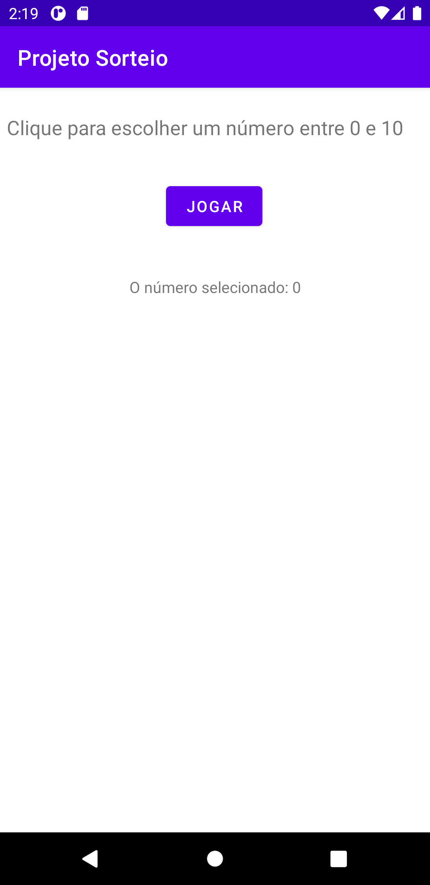

<h1 align="center">Udemy - Desenvolvimento Android Completo 2021</h1>
<h2 align="center">18 Apps</h2>

<!-- ************************************  Badges  ********************************************  -->

  

  

  
  

| Projetos                            | Descrição | Status |
|-------------------------------------|-----------|--------|
| [Primeiro App](./PrimeiroApp)       |           |   ✔️   |
| [Projeto Sorteio](./ProjetoSorteio) |           |   ✔️   |   
|                                     |           |   📺   |
|                                     |           |   🚧   |
|                                     |           |   🚧   |
|                                     |           |   🚧   |
|                                     |           |   🚧   |
|                                     |           |   🚧   |
|                                     |           |   🚧   |

<h2>Imagens do Projeto</h2>

